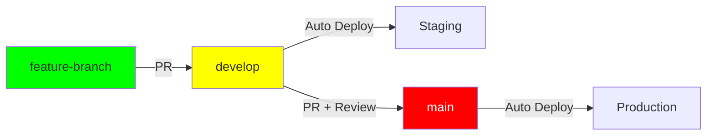

# 🔒 Configuração de Branch Protection

## ⚠️ REGRA OBRIGATÓRIA

A branch `main` **NÃO pode receber commits diretos**. Todo código deve passar por Pull Request.

## 📋 Configuração no GitHub

Acesse: `https://github.com/edcamargo/api.nestjs/settings/branches`

### 1️⃣ Proteger Branch `main`

Clique em **"Add rule"** ou edite a regra existente:

**Branch name pattern:** `main`

#### ✅ Regras Obrigatórias:

- [x] **Require a pull request before merging**
  - [x] Require approvals: **1** (mínimo)
  - [x] Dismiss stale pull request approvals when new commits are pushed
  - [x] Require review from Code Owners (opcional, se tiver CODEOWNERS)

- [x] **Require status checks to pass before merging**
  - [x] Require branches to be up to date before merging
  - **Status checks obrigatórios:**
    - `lint` (do workflow CI)
    - `unit-tests` (do workflow CI)
    - `e2e-tests` (do workflow CI)
    - `build` (do workflow CI)
    - `quality-gate` (do workflow CI)

- [x] **Require conversation resolution before merging**

- [x] **Do not allow bypassing the above settings**
  - ⚠️ Nem admins podem fazer push direto!

- [x] **Restrict who can push to matching branches** (opcional)
  - Selecione apenas bots ou CI (se necessário)

### 2️⃣ Proteger Branch `develop` (Recomendado)

**Branch name pattern:** `develop`

#### ✅ Regras Recomendadas:

- [x] **Require a pull request before merging**
  - Approvals: **1** (pode ser menos restritivo que main)

- [x] **Require status checks to pass before merging**
  - Status checks: lint, unit-tests, e2e-tests, build

- [ ] **Do not allow bypassing** - Pode permitir que mantenedores façam bypass em develop

---

## 🔄 Fluxo Protegido



### ✅ Permitido:
```bash
# Feature para develop (via PR)
git checkout -b feature/xyz
git push origin feature/xyz
# → Abrir PR: feature/xyz → develop

# Develop para main (via PR)
# → Abrir PR no GitHub: develop → main
```

### ⛔ Bloqueado:
```bash
# Commit direto em main
git checkout main
git commit -m "fix"
git push origin main  # ❌ REJEITADO!

# Merge direto via CLI
git checkout main
git merge develop  # ❌ NÃO FUNCIONA sem PR!
git push origin main  # ❌ REJEITADO!
```

---

## 🎯 Benefícios

1. **Code Review Obrigatório**: Todo código em produção foi revisado
2. **Testes Garantidos**: CI passa antes de qualquer merge
3. **Auditoria**: Histórico completo de aprovações
4. **Rollback Fácil**: Cada release tem PR associado
5. **Qualidade**: Múltiplas camadas de validação

---

## 🚨 Emergências

Se precisar fazer um hotfix urgente:

```bash
# 1. Criar hotfix branch da main
git checkout main
git pull origin main
git checkout -b hotfix/critical-bug

# 2. Fazer fix e commitar
git add .
git commit -m "hotfix: corrige bug crítico"
git push origin hotfix/critical-bug

# 3. Abrir PR para main (processo normal)
# → GitHub: hotfix/critical-bug → main
# → Aprovação rápida + CI passa
# → Merge e deploy automático

# 4. Backport para develop
git checkout develop
git merge main  # ou via PR
git push origin develop
```

⚠️ **Mesmo em emergências, o PR é obrigatório!** Configure aprovação rápida com 1 reviewer.

---

## ✅ Checklist de Configuração

- [ ] Branch `main` protegida com PR obrigatório
- [ ] Status checks configurados (lint, tests, build)
- [ ] Aprovação obrigatória (mínimo 1 reviewer)
- [ ] Branch `develop` protegida (recomendado)
- [ ] Environments configurados (staging, production)
- [ ] Secrets configurados (Docker, Database URLs)
- [ ] CI testado com primeiro PR
- [ ] CD testado com deploy em staging
- [ ] CD testado com deploy em production

---

## 📚 Referências

- [GitHub Branch Protection](https://docs.github.com/en/repositories/configuring-branches-and-merges-in-your-repository/managing-protected-branches/about-protected-branches)
- [Required Status Checks](https://docs.github.com/en/repositories/configuring-branches-and-merges-in-your-repository/managing-protected-branches/about-protected-branches#require-status-checks-before-merging)
- [GitHub Environments](https://docs.github.com/en/actions/deployment/targeting-different-environments/using-environments-for-deployment)
